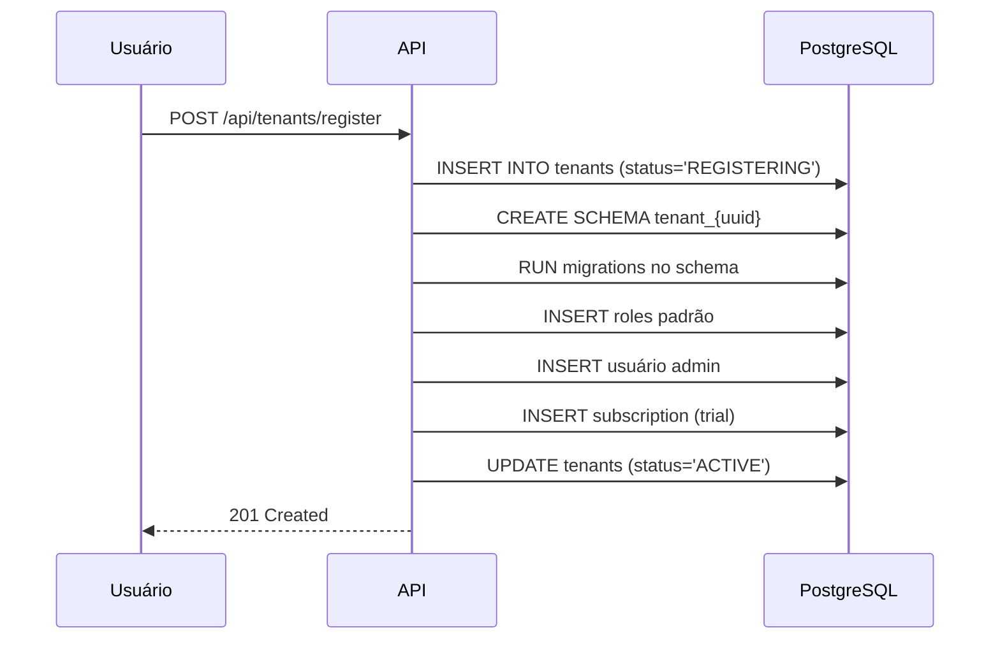

# Multi-tenant — BidFlow Platform

> **Propósito:** Documentar a estratégia enterprise de isolamento multi-tenant.

---

## Estratégia: Schema-per-Tenant

```
PostgreSQL Instance
├── Schema: public                     ← Tabelas globais
│   ├── tenants                        ← Registro de inquilinos
│   ├── plans                          ← Catálogo de planos
│   ├── subscriptions                  ← Assinaturas ativas
│   ├── quota_usage                    ← Uso de quotas
│   └── tenant_domains                 ← Domínios customizados
│
├── Schema: tenant_{uuid}              ← Schema dedicado por tenant
│   ├── users, roles, permissions      ← Auth
│   ├── leads, customers, opps         ← CRM
│   ├── workflow_definitions           ← Workflow Engine
│   ├── workflow_instances             ← Workflow Engine
│   └── tenders, proposals             ← Tender (futuro)
│
├── Schema: tenant_{uuid}              ← Outro tenant
└── Schema: tenant_{uuid}              ← Outro tenant
```

## Isolamento

| Camada | Mecanismo | Garantia |
|--------|-----------|----------|
| **Banco de dados** | Schema PostgreSQL dedicado | Físico — dados de A não vazam para B |
| **Conexão** | `search_path = tenant_{uuid}` por sessão | Lógico — queries só veem o schema correto |
| **Cache (Redis)** | Prefixo `{tenantId}:` em toda chave | Lógico — chaves não colidem |
| **Filas (RabbitMQ)** | Routing key prefixada `{tenantId}.{event}` | Lógico — eventos roteados por tenant |
| **Aplicação** | `TenantContext` obtido do JWT + `TenantGuard` | Aplicação — middleware valida |
| **API** | `@CurrentTenant()` decorator + `X-Tenant-Id` header | Aplicação — request-scoped |

## Tenant Resolution Pipeline

```
Requisição HTTP
    │
    ▼
1. Extrair slug do subdomínio (Host header)
   ├── "empresa-exemplo.bidflow.com" → slug = "empresa-exemplo"
   └── Lookup na tabela tenants WHERE slug = slug
    │
    ▼
2. Extrair X-Tenant-Id header (fallback para API keys)
   ├── Usado por integrações M2M
   └── Lookup na tabela tenants WHERE id = header
    │
    ▼
3. Validar com JWT
   ├── Se usuário autenticado e X-Tenant-Id presente
   └── Verificar se token.tenantId == X-Tenant-Id
    │
    ▼
4. Injetar TenantContext na request (request-scoped)
   └── tenantId, schemaName, userId, role
    │
    ▼
5. PrismaClient configurado com search_path = schema do tenant
```

## Provisão de Novo Tenant



## Quotas por Plano

| Recurso | STARTER | BUSINESS | ENTERPRISE |
|---------|---------|----------|------------|
| Usuários | 10 | 50 | Ilimitado |
| Licitações/mês | 50 | 200 | Ilimitado |
| API calls/mês | 10.000 | 50.000 | 500.000 |
| Workflows ativos | 5 | 20 | 100 |
| Armazenamento | 1 GB | 10 GB | 100 GB |

## Feature Flags por Plano

```yaml
features:
  advancedReporting:
    STARTER: false
    BUSINESS: true
    ENTERPRISE: true
  autoBidding:
    STARTER: false
    BUSINESS: false
    ENTERPRISE: true
  apiAccess:
    STARTER: false
    BUSINESS: true
    ENTERPRISE: true
  whiteLabel:
    STARTER: false
    BUSINESS: false
    ENTERPRISE: true
```
